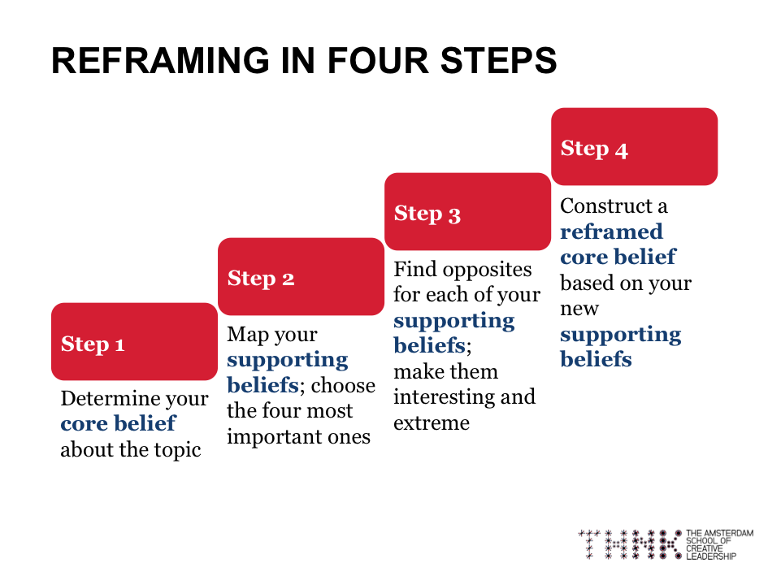
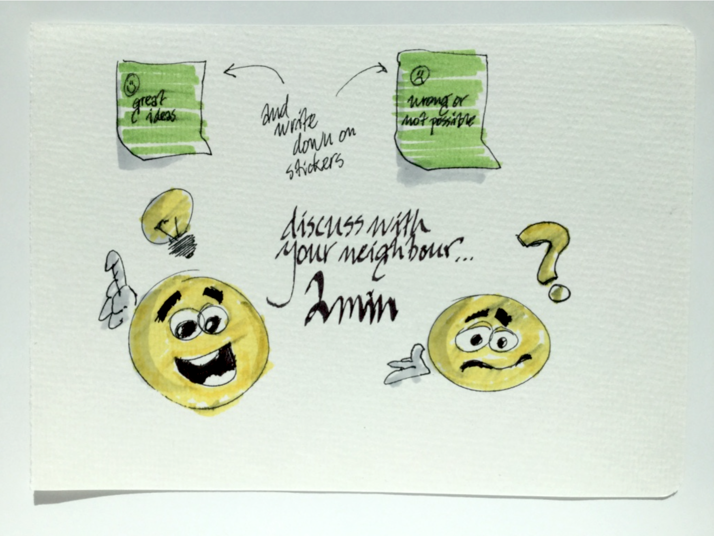
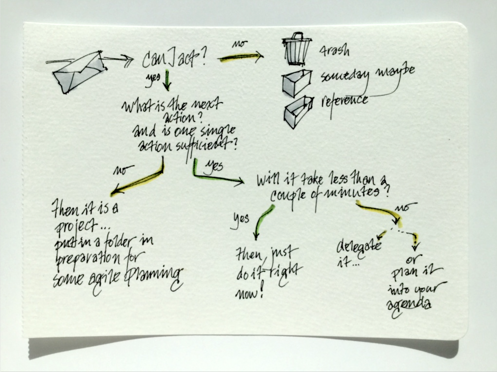
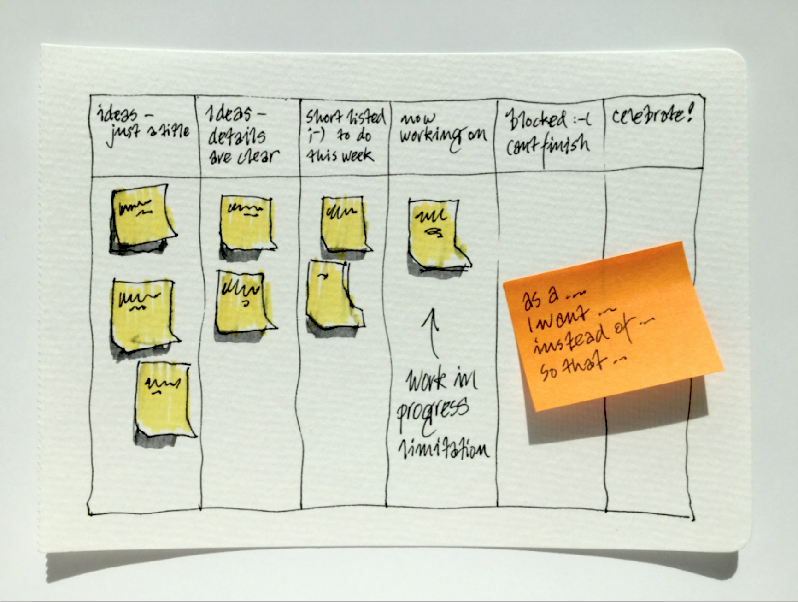
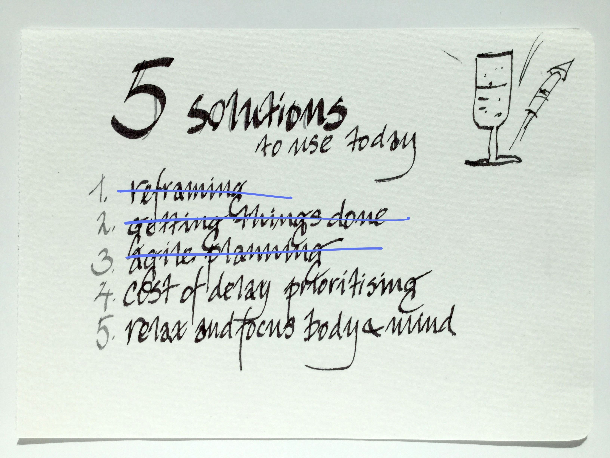
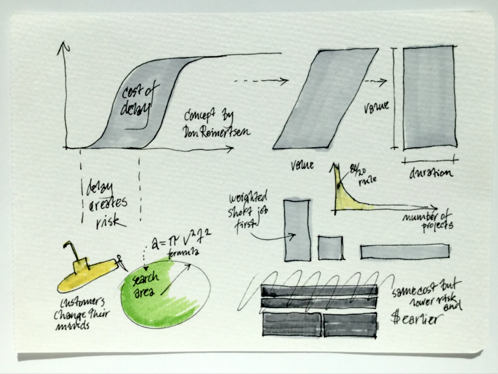

# Being Lean
### 5 techniques to try individually today!

 
 
 
<small>written by Johan Frisk&copy; for [LeanBee](http://leanbee.se)</small>

---

##### this is the total process, let's go through it step-by-step

---

##### note: to get full effect... use all of the techniques!

--- &vertical

## How to use this presentation
<small>
There are five steps to the process, they are all illustrated by a drawing. Use 
them to try all the steps at once, or one at a time.

 

##### Navigate in these four ways:
1. If you go *horisonally* to the right you will see the eight steps in sequence.
2. If you go *down* on any step you will find a written instruction and,
3. if you hit *'esc'* you will see a navigational view of all the slides.
4. If you press *'s'* anywhere you come to the presenter's window.

</small>

***

## Where should you do the work?

<small>

- Step 1 - should be done first thing in the morning, while getting ready for the day.
- Step 2 - is the first thing to do sitting down at your desk.
- Step 3 - is done in the office right before starting the work day.
- Step 4 - is about prioritising and should be kept in mind at all times.
- Step 5 - is how to concentrate just before any important task

</small>

--- &vertical

##### First step: Reframing

***

***

--- &vertical

##### Second step: Getting things done!

***

***

--- &vertical

##### Third step: Agile planning (Kanban)

***

***

--- &vertical

##### Fourth step: Prioritise with 'Cost of Delay'

***

***

--- &vertical

##### Fifth step: Relax and focus before acting

***

***

***

--- &vertical

##### That's all there is to it! and don't forget...

***

##### remember: to get full effect... use all of the techniques!

---

# Thanks!
<small>johan@leanbee.se</small> 

